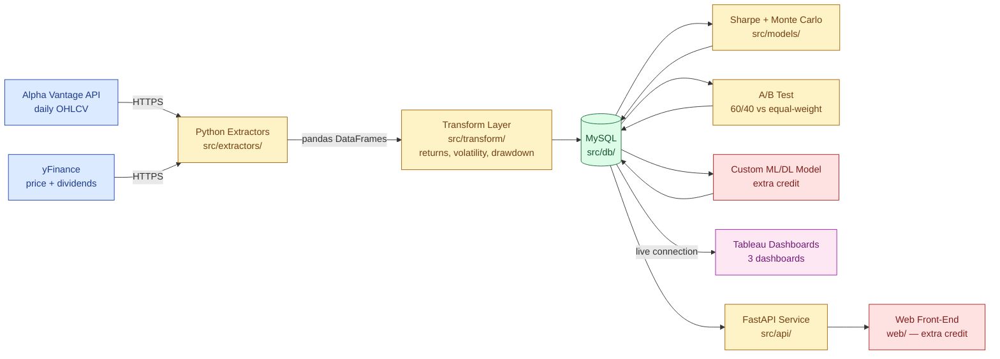
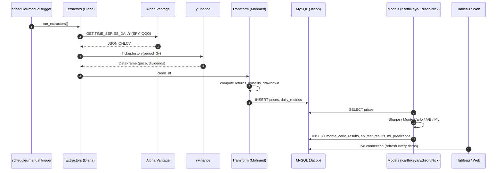
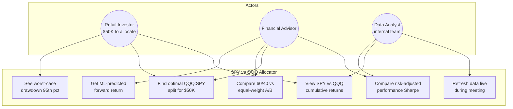
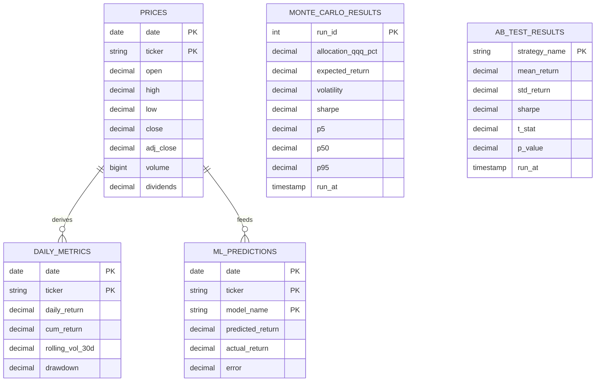

# Architecture & Workflow

Owner: Diana Lucero. Diagrams render natively on GitHub — no external image hosting needed.

## 1. End-to-End Pipeline (Data Flow)

## 2. ETL Sequence

## 3. Use Case Diagram (Stakeholders)

## 4. Data Model (MySQL — Jacob will refine)

## 5. Layer Ownership

| Layer | Module | Owner | Status |
|-------|--------|-------|--------|
| Extract — Alpha Vantage | `src/extractors/alpha_vantage.py` | Diana | done |
| Extract — yFinance | `src/extractors/yfinance_extract.py` | Diana | done |
| Extract — orchestrator | `scripts/run_extractors.py` | Diana | done |
| Transform | `src/transform/metrics.py` | Mohmed | pending |
| Database — schema | `src/db/schema.sql` | Jacob | pending |
| Database — loaders | `src/db/loaders.py` | Jacob | pending |
| Model — Sharpe + Monte Carlo | `src/models/sharpe.py`, `monte_carlo.py` | Karthikeya | pending |
| Model — A/B test | `src/models/ab_test.py` | Edison | pending |
| Model — Custom ML/DL | `src/models/ml_model.py` | Nick (extra credit) | done |
| API service | `src/api/main.py` | Jacob | pending |
| Web Front-End | `web/` | Mohmed (extra credit) | pending |
| Tableau Dashboards | `tableau/*.twb` | All (paired) | pending |
